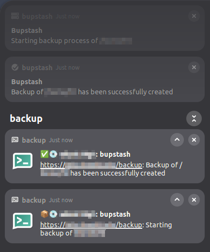
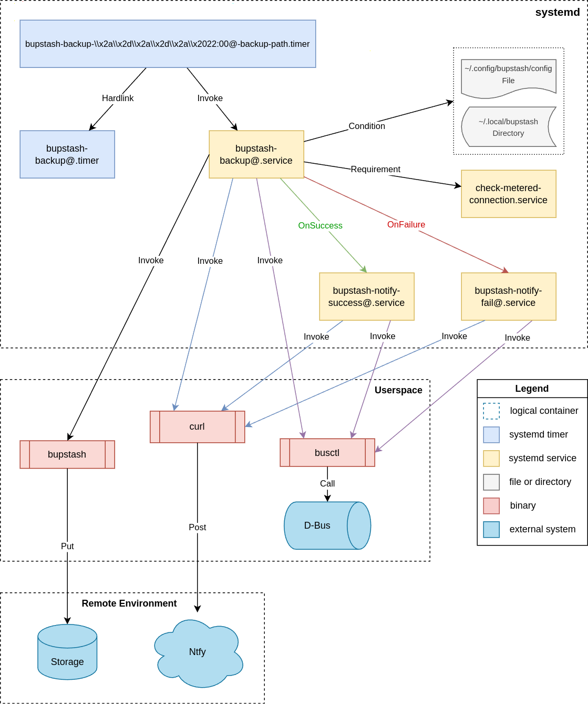
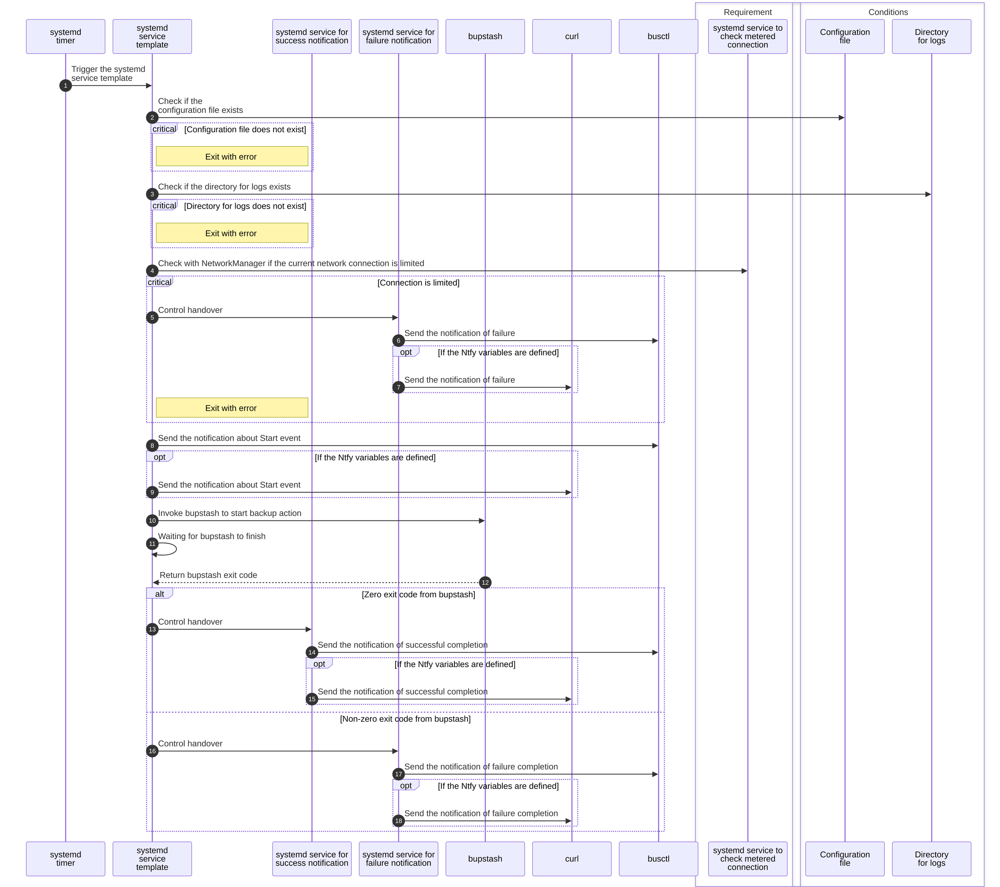

# Bupstash client integration with systemd

- [Description](#description)
- [Functionality](#functionality)
- [Prerequisites](#prerequisites)
- [Design](#design)
    - [Simplified System Design](#simplified-system-design)
    - [Execution Sequence](#execution-sequence)
- [Semi-Automated Installation](#semi-automated-installation)
    - [Installation Scenario](#installation-scenario)
    - [Log Files](#log-files)
    - [Scheduled Tasks](#scheduled-tasks)
- [Configuration](#configuration)



## Description
Semi-automated [systemd services](https://www.freedesktop.org/software/systemd/man/latest/systemd.unit.html) for [bupstash](https://bupstash.io/) client.

## Functionality
* [systemd service template](https://www.freedesktop.org/software/systemd/man/latest/systemd.service.html#Service%20Templates) to make backup path configurable
* [systemd timer](https://www.freedesktop.org/software/systemd/man/latest/systemd.timer.html) to run backup by a scheduler
* Check if connection is metered to prevent backup start
* `OnFailure` and `OnSuccess` hooks to make a [D-Bus](https://www.freedesktop.org/wiki/Software/dbus/) notification

## Prerequisites
* systemd is installed with version >= 218
* The following utils/tools are installed or available as built-in from shell:
  * bash/dash
  * bupstash
  * busctl (shipped with systemd)
  * curl (optional)
  * egrep
  * install
  * ls
  * make
  * mkdir
  * NetworkManager
  * rm
  * sed
  * systemctl (shipped with systemd)
  * touch

## Design

### Simplified System Design



### Execution Sequence



## Semi-Automated Installation

### Installation Scenario
The Makefile script is to check the presence of required utils, to create necessary directories if they don't exist, to create a demo configuration, then to install systemd service and timer personally for the current user, to install main executable, and, finally, enable systemd service and timer:

```shell
~> git clone https://github.com/freefd/bupstash-systemd/ /tmp/bupstash-systemd
~> cd /tmp/bupstash-systemd/
~> make install
---  Check prerequisites
[=] All prerequisites have been met

--- Create bupstash directories if necessary
[+] /home/username/.config/bupstash
[+] /home/username/.local/bupstash

--- Create demo configuration
[+] /home/username/.config/bupstash/config

--- Render systemd files
[^] Render exclusion rules
'/tmp/bupstash-systemd/src/bupstash-backup@.template' -> '/tmp/bupstash-systemd/src/bupstash-backup@.service'
'/tmp/bupstash-systemd/src/bupstash-notify-fail@.template' -> '/tmp/bupstash-systemd/src/bupstash-notify-fail@.service'
'/tmp/bupstash-systemd/src/bupstash-notify-success@.template' -> '/tmp/bupstash-systemd/src/bupstash-notify-success@.service'

--- Install systemd user files
[+] bupstash-notify-fail@.service
'/tmp/bupstash-systemd/src/bupstash-notify-fail@.service' -> '/home/username/.config/systemd/user/bupstash-notify-fail@.service'
[+] bupstash-notify-success@.service
'/tmp/bupstash-systemd/src/bupstash-notify-success@.service' -> '/home/username/.config/systemd/user/bupstash-notify-success@.service'
[+] bupstash-backup@.service
'/tmp/bupstash-systemd/src/bupstash-backup@.service' -> '/home/username/.config/systemd/user/bupstash-backup@.service'
[+] check-metered-connection.service
'/tmp/bupstash-systemd/src/check-metered-connection.service' -> '/home/username/.config/systemd/user/check-metered-connection.service'
[+] bupstash-backup@.timer
'/tmp/bupstash-systemd/src/bupstash-backup@.timer' -> '/home/username/.config/systemd/user/bupstash-backup@.timer'

--- Enable systemd user services
[*] check-metered-connection.service
Created symlink '/home/username/.config/systemd/user/bupstash-backup@.service.wants/check-metered-connection.service' → '/home/username/.config/systemd/user/check-metered-connection.service'.

--- Reload systemd user daemon
```

The Makefile also supports `uninstall` target:
```shell
~> make help
install
	- Install systemd files, reload user systemd files and enable them
uninstall
	- Uninstall systemd files, reload user systemd files, preserve the configuration and logs
clean
	- Clean rendered systemd files from templates
readme
	- How to configure Systemd timers
help
	- Show all usable commands
```

But the configuration file and directory with logs will be preserved

```shell
~> make uninstall
---  Check prerequisites
[=] All prerequisites have been met

--- Disable systemd user services
[-] check-metered-connection.service

--- Uninstall systemd user files
[-] /home/username/.config/systemd/user/bupstash-notify-fail@.service
[-] /home/username/.config/systemd/user/bupstash-notify-success@.service
[-] /home/username/.config/systemd/user/bupstash-backup@.service
[-] /home/username/.config/systemd/user/check-metered-connection.service
[-] /home/username/.config/systemd/user/bupstash-backup@.timer

--- Reload systemd user daemon
```

<br/>

After installation, do not forget to edit the `~/.config/bupstash/config` file (see [Configuration](#configuration)), and then you can manually run the backup service. You need to adapt the filesystem path to a systemd compatible path with `systemd-escape`.

```shell
~> systemd-escape --template=bupstash-backup@.service /path/to/directory
bupstash-backup@-path-to-directory.service
~> systemctl --user start bupstash-backup@-path-to-directory.service
```

### Log Files

The log files will be stored to the `~/.local/bupstash/` directory created during installation. Each log file will be named according to the `<YEAR><MONTH><DAY><HOUR><MINUTES><SECONDS><BACKUP_PATH>.log` pattern, e.g. `20250414000509-path-to-directory.log`

> [!IMPORTANT]
> This solution does not have a retention policy nor rotation logs mechanism. Please consider rotating logs manually or using external tools.

### Scheduled Tasks

To schedule the backup tasks, you need:
1. To derive the schedule time with `systemd-analyze calendar`: `18:00` is used as an example time to trigger the systemd service each day
2. To convert the schedule time with `systemd-escape` and to double the backslashes to make it compatible with filesystem
3. To convert the filesystem path with `systemd-escape` 

```shell
~> systemd-analyze calendar '18:00' | grep Norm
Normalized form: *-*-* 18:00:00

~> systemd-escape "*-*-* 18:00" | sed -e 's;\\;\\\\;g'
\\x2a\\x2d\\x2a\\x2d\\x2a\\x2018:00

~> systemd-escape /path/to/directory
-path-to-directory
```

Combine both outputs, make a hardlink from the template timer to the target timer, and enable it.

```shell
~> ln ~/.config/systemd/user/bupstash-backup@.timer ~/.config/systemd/user/bupstash-backup-\\x2a\\x2d\\x2a\\x2d\\x2a\\x2018:00@-path-to-directory.timer
~> systemctl --user daemon-reload
~> systemctl --user enable --now bupstash-backup-\\x2a\\x2d\\x2a\\x2d\\x2a\\x2018:00@-path-to-directory.timer
```

Show the timer
```shell
~> systemctl --user list-timers bupstash-backup-\\x2a\\x2d\\x2a\\x2d\\x2a\\x2018:00@-path-to-directory.timer
NEXT                        LEFT LAST PASSED UNIT                                                                   ACTIVATES
Mon 2025-04-14 18:00:00 UTC  18h -         - bupstash-backup-\x2a\x2d\x2a\x2d\x2a\x2018:00@-path-to-directory.timer bupstash-backup@-path-to-directory.service
```

## Configuration

The following list of variables is supported:
* __BUPSTASH_REPOSITORY__ - Specify the bupstash SSH repository URL, check the [official documentation](https://bupstash.io/doc/man/bupstash-put.html#ENVIRONMENT)
* __BUPSTASH_KEY__ - Specify bupstash access key path, check the [official documentation](https://bupstash.io/doc/man/bupstash-put.html#ENVIRONMENT) 
* __NTFY_TOKEN__ - Specify Ntfy access token, check the [official documentation](https://docs.ntfy.sh/publish/#access-tokens)
* __NTFY_SERVER__ - Specify Ntfy server URL, can be either private or public
* __NTFY_TOPIC__ - Specify an individual or multiple comma separated topics on Ntfy server

A sample production-like configuration:

```shell
BUPSTASH_REPOSITORY=ssh://bupstash.domain.tld/backups/storage/username/
BUPSTASH_KEY=/home/username/path/to/bupstash.key
NTFY_TOKEN=tk_demodemodemodemodemodemodemod
NTFY_SERVER=https://ntfy.sh
NTFY_TOPIC=test
```